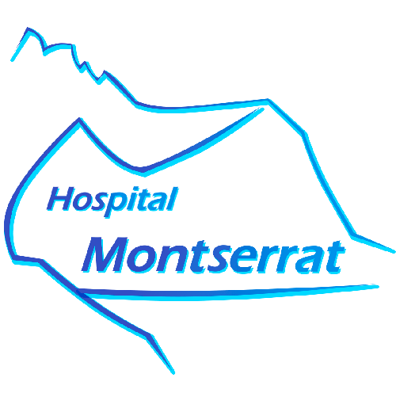

# Hospital Montserrat

## Descripción
Aquest projecte consisteix en un **Sistema Integrat de Gestió Hospitalària** per a l'Hospital Montserrat, dissenyat per centralitzar i optimitzar tota l'operativa administrativa i clínica del centre.

L'aplicació actua com una interfície de control per al personal, connectada a una base de dades robusta que, segons la teva descripció, garanteix l'alta disponibilitat i seguretat mitjançant una arquitectura de servidor principal i replicació a un servidor esclau.

### Caraterístiques clau

#### **1. Arquitectura i Seguretat**
Seguretat d'Accés: *L'aplicació compta amb un sistema de login on les contrasenyes s'emmagatzemen encriptades mitjançant l'algoritme bcrypt.*

Gestió de Rols: *El sistema diferencia entre un usuari Admin (amb permisos per donar d'alta personal i crear nous usuaris de l'app) i els usuaris estàndard (enfocats a la consulta de dades).*

Redundància: *Tot i que l'aplicació apunta al servidor principal, la infraestructura de replicació assegura que les dades estiguin protegides davant de possibles fallades.*

#### **2. Gestió d'Infraestructura i Recursos**
*El sistema permet tenir un control detallat de la planta física de l'hospital:*

Organització per plantes: *Gestió d'habitacions i quiròfans.*

Inventari mèdic: *Control d'aparells i la seva ubicació específica en els quiròfans.*

#### **3. Gestió de Personal (Estructura Jeràrquica)**
*La base de dades utilitza una estructura de superclasse/subclasse per gestionar el personal de forma eficient:*

Personal Mèdic: *Metges amb les seves especialitats i currículums.*

Infermeria: *Assignació directa a metges o a plantes específiques.*

Personal Vari: *Administratius, personal de neteja, etc.*

#### **4. Operativa Clínica i Planificació**
*L'aplicació facilita el dia a dia de l'hospital mitjançant diversos mòduls:*

Gestió de Pacients: *Registre de dades personals i historial.*

Visites Mèdiques: *Agenda de visites amb diagnòstics i generació de receptes de medicaments.*

Control de Quiròfans: *Sistema de reserves amb un trigger de seguretat que impedeix la duplicitat de reserves en el mateix horari i sala.*

Ingressos: *Gestió de l'ocupació de llits i habitacions.*

#### **5. Consultes i Informes (Reporting)**
*L'usuari pot visualitzar de forma ràpida l'estat de l'hospital a través de:*

Planificació diària de quiròfans i visites.

Informes de recursos per planta (quantes habitacions o quiròfans hi ha lliures/ocupats).

Estadístiques de visites diàries per monitorar la càrrega de treball.

# Resum tecnològic:

**Backend:** *PostgreSQL (amb procediments emmagatzemats, triggers i funcions en PL/pgSQL).*

**Frontend:** *Python (utilitzant la llibreria Tkinter per a la interfície gràfica).*

**Connexió:** *psycopg2 per a la comunicació directa amb la base de dades.*
